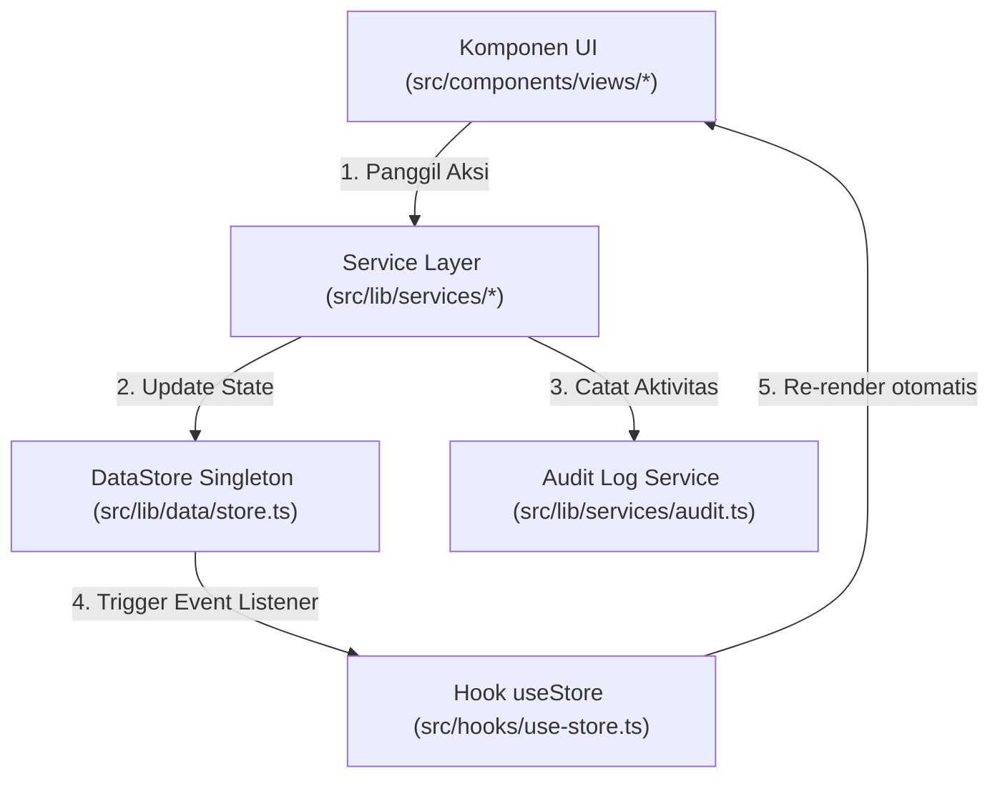

# Dokumentasi & Ringkasan Struktur Kode — JURI HR

Dokumen ini berisi gambaran umum arsitektur, struktur proyek, peta direktori, dan pola aliran data untuk sistem manajemen HR **JURI HR** (Multi-Outlet Bakery & Coffee Bun).

---

## 1. Ikhtisar Arsitektur & Tech Stack

- **Framework & Core**: Next.js 16 (App Router) + React 19 + TypeScript (Strict Mode).
- **Styling & UI Components**: Tailwind CSS v4, shadcn/ui, Lucide Icons.
- **Visualisasi & Peta**: Recharts (Grafik & Statistik Dashboard/Laporan), Leaflet & React-Leaflet (Peta Domisili Karyawan & Geofence Outlet).
- **Navigasi Single Page Application (SPA)**: Custom Hash Router (`use-route.ts` & `routes.ts`) berbasis **`useSyncExternalStore`** untuk sinkronisasi rute URL real-time tanpa *page reload*.
- **State Management & Sinkronisasi Data**:
  - **Single Source of Truth**: DataStore in-memory singleton (`src/lib/data/store.ts`).
  - **Subscriber Hooks**: `useStore` (`src/hooks/use-store.ts`) yang terhubung langsung ke event listener DataStore.
  - **Service Layer**: Mengisolasi logika mutasi data (`master-data.ts`, `schedule.ts`, `workforce.ts`, `finance.ts`) serta secara otomatis mencatat riwayat ke **Audit Log** (`audit.ts`).
- **Database & ORM**: Prisma ORM v6 dengan SQLite (`db/custom.db`, schema `prisma/schema.prisma`).

---

## 2. Peta Direktori & File Proyek (`src/`)

```text
JuriHR/
├── AGENTS.md                    # Panduan & Konteks AI Assistant
├── PROJECT_STRUCTURE.md         # Dokumentasi Struktur Kode ini
├── README.md                    # Ringkasan Proyek & Daftar Modul
├── package.json                 # Dependensi & NPM Scripts
├── tsconfig.json                # Konfigurasi TypeScript
├── db/ & prisma/
│   ├── custom.db                # Database SQLite lokal
│   └── schema.prisma            # Schema ORM Prisma (Model Employee, Outlet, Shift, dll.)
│
├── src/
│   ├── app/                     # App Router Entry Point
│   │   ├── layout.tsx           # Root Layout (ThemeProvider & Context)
│   │   ├── page.tsx             # Entry Point Utama -> Rendernya ke AppShell
│   │   └── globals.css          # Design Tokens & CSS Variables JURI Bun
│   │
│   ├── components/              # Seluruh Komponen Antarmuka
│   │   ├── layout/              # Rangka Utama Aplikasi
│   │   │   ├── app-shell.tsx         # Wrapper utama (Sidebar + Content Area)
│   │   │   ├── app-sidebar.tsx       # Collapsible Sidebar Navigasi
│   │   │   ├── app-topbar.tsx        # Top Bar (Pencarian ⌘K, Notifikasi, Theme, Profil)
│   │   │   └── app-breadcrumb.tsx    # ERPNext-Style Breadcrumb (🏠 / [Group] / [Fitur])
│   │   │
│   │   ├── common/              # Reusable Primitive Components
│   │   │   ├── data-table.tsx        # TanStack Table dengan Configure Columns ERPNext
│   │   │   ├── import-export-dialog.tsx # Universal Import (.xls/.csv) & Export Dialog
│   │   │   ├── confirm-dialog.tsx    # Modal Konfirmasi Hapus/Arsip
│   │   │   ├── status-badge.tsx      # Indicator Status Aktif/Proses/Selesai
│   │   │   ├── field.tsx             # Layout Form Input & Label Standard
│   │   │   └── page-header.tsx       # Compact Action Bar Header
│   │   │
│   │   ├── ui/                  # Primitive UI Components (shadcn/ui)
│   │   │   └── button, card, dialog, input, select, popover, dll.
│   │   │
│   │   └── views/               # 17 Modul Halaman Utama Aplikasi
│   │       ├── dashboard-view.tsx       # Dashboard Metrik & Aktivitas
│   │       ├── employees-view.tsx       # Master Data Karyawan (Tabel & Filter)
│   │       ├── employee-detail.tsx      # Detail Profil Karyawan Lengkap
│   │       ├── employee-form-page.tsx   # Form Karyawan Full-Page (Tanpa Pop-up Modal)
│   │       ├── outlet-view.tsx          # Master Outlet & Geofencing Cabang
│   │       ├── positions-view.tsx       # Master Posisi/Jabatan & Divisi HQ/Outlet
│   │       ├── domicile-view.tsx        # Peta Domisili Karyawan (Leaflet Map)
│   │       ├── contracts-view.tsx       # Monitoring Masa Berakhir Kontrak
│   │       ├── shift-groups-view.tsx    # Pola Shift Mingguan & Template Jam Kerja
│   │       ├── schedule-view.tsx       # Kalender Jadwal (Harian/Mingguan/Bulanan)
│   │       ├── holiday-view.tsx         # Hari Libur & Auto-Populate Libur Nasional ID
│   │       ├── attendance-view.tsx      # Rekap Absensi & Potongan Keterlambatan
│   │       ├── leave-view.tsx           # Pengajuan & Saldo Cuti/Izin/Sakit
│   │       ├── overtime-view.tsx        # Pengajuan & Verifikasi Lembur Operasional
│   │       ├── payroll-view.tsx         # Rekapitulasi Gaji & Slip Gaji
│   │       ├── notification-view.tsx    # Pusat Notifikasi Sistem
│   │       ├── reports-view.tsx         # Laporan Multi-Modul (Filter & Grafik)
│   │       ├── audit-view.tsx           # Log Jejak Perubahan Data (Audit Trail)
│   │       └── settings-view.tsx        # Pengaturan Sistem & Mock Data Reset
│   │
│   ├── hooks/                   # Custom Hooks
│   │   ├── use-store.ts         # Hook penyambung komponen UI ke DataStore
│   │   └── use-mobile.ts        # Helper deteksi layar mobile/responsive
│   │
│   └── lib/                     # Core Business Logic & Services
│       ├── types/               # Type Definitions (Employee, Outlet, Shift, Payroll, dll.)
│       ├── data/
│       │   ├── store.ts         # Central DataStore in-memory singleton
│       │   └── seed.ts          # Deterministic seed mock data
│       ├── services/
│       │   ├── master-data.ts   # Service Karyawan, Outlet, Posisi, Divisi, Contract
│       │   ├── schedule.ts      # Service Shift, Schedule, Holiday, Shift Swap
│       │   ├── workforce.ts     # Service Absensi, Cuti, Lembur
│       │   ├── finance.ts       # Service Payroll, Notifikasi, Laporan
│       │   ├── dashboard.ts     # Metrik & Agregasi Dashboard
│       │   └── audit.ts         # Service Audit Logging
│       ├── router/
│       │   ├── routes.ts        # Navigasi & Pemetaan 17 Rute Hash
│       │   └── use-route.ts     # Real-time Hash Router (useSyncExternalStore)
│       └── utils.ts             # Helper Utility (formatRupiah, formatDate, Haversine, dll.)
```

---

## 3. Pola Data Flow & Interaksi Komponen



---

## 4. Perintah Executable Lingkungan (Windows OS)

- **Menjalankan Server Pengembang**:
  ```powershell
  npm.cmd run dev
  ```
- **Pemeriksaan Tipe TypeScript**:
  ```powershell
  npx.cmd tsc --noEmit
  ```
- **Pemeriksaan Linter**:
  ```powershell
  npm.cmd run lint
  ```
- **Build Produksi**:
  ```powershell
  npm.cmd run build
  ```
